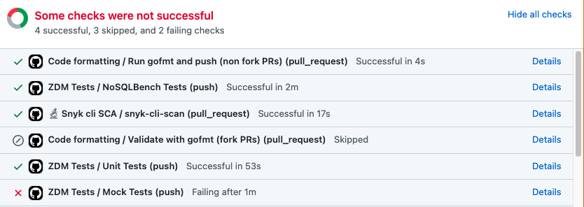
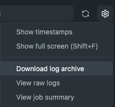
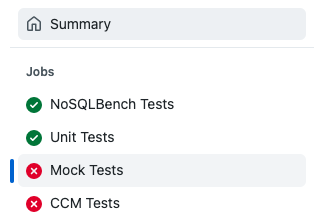
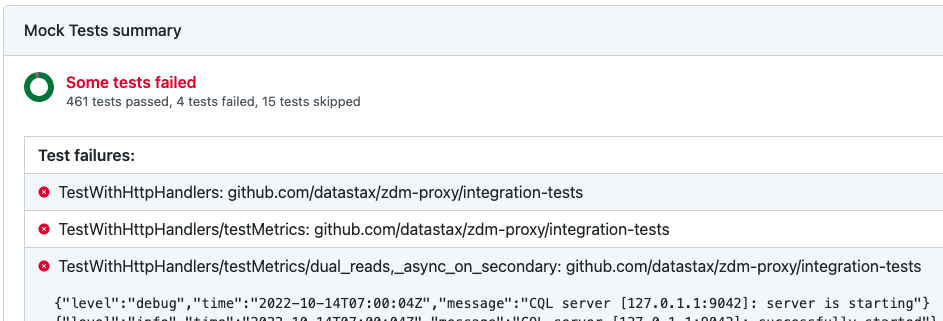

# Contribution Guidelines

Thanks for your interest in contributing to the ZDM Proxy!

Below you'll find some guidelines to help you get started.
There are multiple ways you can contribute to the project, you can open Pull Requests
to fix a bug or add a new feature, report issues or improve the documentation.

The proxy is written in Go, so if you're already familiar with the language, you'll notice
the project uses most of the standard tools and conventions in the Go ecosystem for code formatting, building
and testing. But if you're still new to it, don't worry, we'll give you an overview in the next
few sections.

- [Code Contributions](#code-contributions)
  - [Running Unit Tests](#running-unit-tests)
  - [Running Integration Tests](#running-integration-tests)
    - [Simulacron](#simulacron)
    - [CCM](#ccm)
  - [Running on Localhost with Docker Compose](#running-on-localhost-with-docker-compose)     
  - [Debugging](#debugging)
  - [CPU and Memory Profiling](#cpu-and-memory-profiling)
  - [Pull Request Checks](#pull-request-checks)
    - [Code Formatting](#code-formatting)

## Code Contributions

---
**Note:** If you'll contribute code or examples via a Pull Request (PR) to this ZDM Proxy project, be sure to first read 
the Contribution License Agreement (CLA) at https://cla.datastax.com/. You'll be required to sign it with your GitHub
account before we can consider accepting your PR changes.
---

**Before you start working on a feature or major change, we ask you to discuss your idea with the members
of the community by opening an issue in GitHub, this way we can discuss design considerations and
feasibility before you invest your time on the effort.**

When  you're ready to code, follow these steps:

1. If you haven't done so yet, go ahead now and fork the ZDM Proxy repository into your own Github account and clone it
on your machine. That's how you'll be able to make contributions, you cannot push directly to the main repository, but
you can open a Pull Request for your branch when you're ready.


2. From your fork, create a new local branch where you'll make changes. Give it a short, descriptive, name.
If there's an associated issue open, include its number as a prefix, *zdm-#issue-name*, for example: zdm-10-fix-bug-xyz.


3. Make the changes you want locally and validate them with the [test tools](#running-unit-tests) provided. Push the
updated code to the remote branch in your fork.


4. Finally, when you're happy with your edits, open a Pull Request through the GitHub UI.


5. The automated tests in GitHub Actions will kick in and in a few minutes you should
have some results. If any of the checks fail, take a look at the workflow [logs](#pull-request-checks) to understand
what happened. You can push more commits to the PR until the problem is resolved, the checks will run again.


6. Once all checks are passing, your PR is ready for review and the members of the ZDM Proxy community will
start the process. You may be asked to make further adjustments, this is an iterative process, but
in the end if everything looks good, you'll be able to merge the PR to the main branch.


7. Congratulations! At this point your code is ready to be released in the official distribution in the
next release cycle. Keep an eye on the Releases page for new versions: https://github.com/datastax/zdm-proxy/releases

### Running Unit Tests

The main source code of the project is located under the [proxy](https://github.com/datastax/zdm-proxy/tree/main/proxy)
folder, but you'll notice some files have the following name pattern `*_test.go` next to the main file,
these are the unit tests. These tests are meant to run very quickly with no external dependencies.

To run the unit tests, go the root of the project in a terminal window and execute the following command:

> $ go test -v ./proxy/... 

You should see a PASS or FAIL message at the end of the execution.

Make sure you add tests to your PR if you're making a major contribution.

### Running Integration Tests

The integration tests have different execution modes that allow you to test the proxy with
an in-memory CQL server, a mock service ([Simulacron](https://github.com/datastax/simulacron)), or an actual database
(managed by [CCM](https://github.com/riptano/ccm)).
By the default, it will run both the in-memory and Simulacron tests, but you can selectively
enable the ones you want with the command-line flags we'll see next.

#### Simulacron

Simulacron is a native protocol server simulator for Apache Cassandra&reg; written in Java. It allows us to test the
protocol message exchanges over a socket from the proxy to the backend without having to run a fully-fledged database.

It needs to be installed separately, and for that follow the installation instructions available
[here](https://github.com/datastax/simulacron#prerequisites).

Now set the `SIMULACRON_PATH` environment variable to the path of the jar file you downloaded in the previous step.

Simulacron relies on loopback aliases to simulate multiple nodes. On Linux or Windows, you shouldn't have anything to do.
On MacOS, run this script:

```bash
#!/bin/bash
for sub in {0..4}; do
    echo "Opening for 127.0.$sub"
    for i in {0..255}; do sudo ifconfig lo0 alias 127.0.$sub.$i up; done
done
```
It may take a couple of minutes for it to complete and settle down. Also, note that this does not survive reboots.

Now you should be ready to run the Simulacron tests with:

> $ go test -v ./integration-tests

#### CCM

Cassandra Cluster Manager (CCM) is a tool written in Python that manages local Cassandra installations for testing purposes.
These tests will be run automatically by Github when you open a PR, but you can optionally run them locally too,
for that follow the installation instructions available in the CCM [repository](https://github.com/riptano/ccm#installation).

Once you have CCM installed, run the tests with:

> $ go test -v ./integration-tests -RUN_CCMTESTS=true

By the default, that will include the mock tests too (CQL Server and Simulacron), but you can disabled them and run CCM
only with:

> $ go test -v ./integration-tests -RUN_CCMTESTS=true -RUN_MOCKTESTS=false

In order to specify a specific Cassandra or DSE version, use the `CASSANDRA_VERSION` or `DSE_VERSION` flags, for example:

> $ go test -v ./integration-tests -RUN_CCMTESTS=true -CASSANDRA_VERSION=3.11.8

### Running on Localhost with Docker Compose

Sometimes you may want to run the proxy on localhost to do some manual validation, but in order to do anything meaningful
with it, you'll need to connect it to two database clusters (ORIGIN and TARGET). To simplify the process we provide a
[docker-compose](https://docs.docker.com/compose/) definition that handles the setup for you.

The definition will start two Cassandra clusters, one ZDM proxy instance and automatically run a NoSQLBench workload to
verify the setup.

Start the services with the following command (this assumes you have docker-compose [installed](https://docs.docker.com/compose/install/)):

> $ docker-compose -f docker-compose-tests.yml up

After it completes, it will still keep the containers running in case you want to do any further inspection.
To stop the services, hit CTRL+C and delete the containers with:

> $ docker-compose -f docker-compose-tests.yml down

### Debugging

Similarly, there's a docker-compose setup for debugging the proxy while connected to running clusters. The provided
setup uses [Delve](https://github.com/go-delve/delve) to enable remote debugging so you can connect to the proxy from
your IDE.

First, start docker-compose with the debug definition:

> $ docker-compose -f docker-compose-debug.yml up

Wait until you this message `API server listening at: [::]:2345`, then you'll know the debugger is ready.

Now attach your IDE to the debugger at `localhost:2345`. If you're using IntelliJ, check
[this](https://www.jetbrains.com/help/go/attach-to-running-go-processes-with-debugger.html#step-4-start-the-debugging-process-on-the-client-computer)
guide to learn how.

At this point the proxy is ready to receive requests, so enter some breakpoints in the IDE and connect some CQL client
to the proxy at `localhost:9042`.

### CPU and Memory Profiling

During development, you may want to enable CPU and Memory profiling on the proxy to investigate some performance degradation.
To do that, you'll have to build the proxy with profiling enabled first:

> $ go build -tags profiling

And then when you start the proxy, specify where to save the profile data:

> $ ./proxy -cpu_profile cpu.prof -mem_profile heap.prof

Note that these files will be created at the moment the proxy is stopped. These files can then be opened using the
Go tool [pprof](https://go.dev/blog/pprof).

### Pull Request Checks

All the tests we described above are also executed in an automated fashion by a GitHub Workflow when you
open a Pull Request.

Below you see an example of a PR that had some successful tests but a couple that failed.



To investigate the failures, click the `Details` link next to the job you're interested in and that will take you to
execution logs. You can download the full log file by going to `Gear icon > Download log archive`:



In case you just want to see an overview of the test results, click the `Summary` link on the top left-hand side of the
page, which will show you only the relevant pieces of the log for the failed tests.



