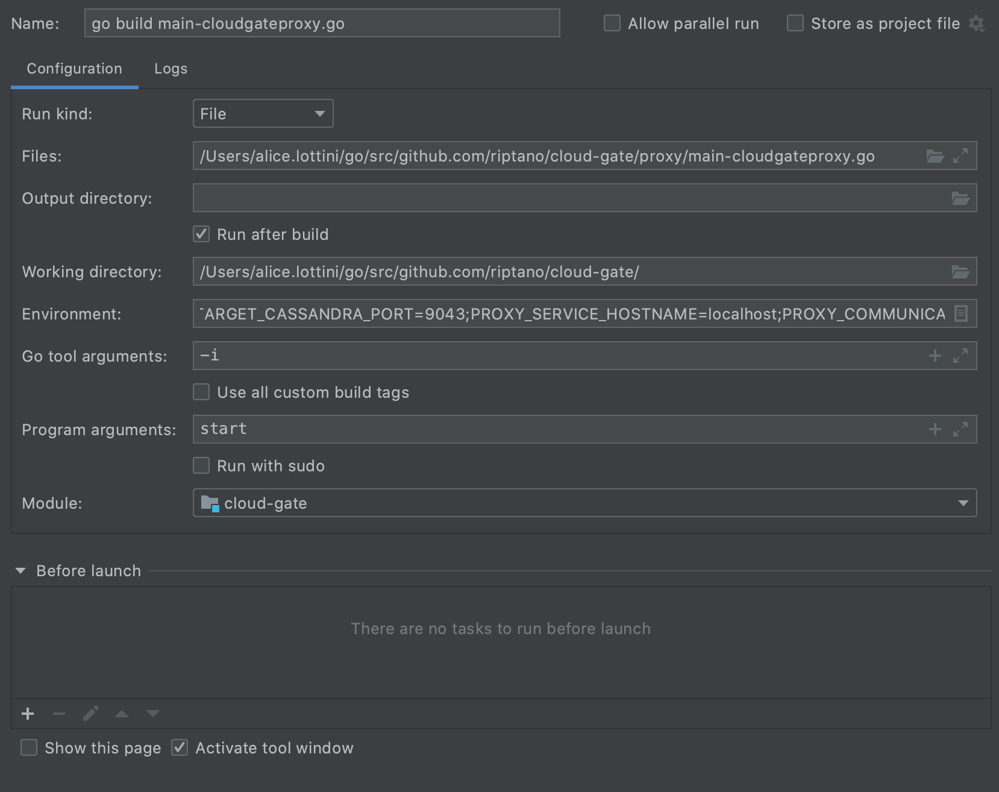

# Zero Downtime Migration (Cloud-Gate) Proxy

## Overview

This is a simple proxy component to enable users to migrate without downtime from a Cassandra cluster to another (which may be an Astra cluster) without requiring code changes in the application client.

The only change to the client is pointing it to the proxy rather than directly to the original cluster. In turn, the proxy connects to both origin and target clusters.

The proxy will forward read requests only to the origin cluster, while writes will be sent to both clusters concurrently.

An overview of the proxy architecture and logical flow will be added here soon.

## Environment Variables

```shell
PROXY_INDEX=0
PROXY_ADDRESSES=127.0.0.1
ORIGIN_ENABLE_HOST_ASSIGNMENT=true
TARGET_ENABLE_HOST_ASSIGNMENT=true
ORIGIN_CASSANDRA_CONTACT_POINTS=127.0.0.1 #required
ORIGIN_CASSANDRA_USERNAME=cassandra       #required
ORIGIN_CASSANDRA_PASSWORD=cassandra       #required
ORIGIN_CASSANDRA_PORT=9042
TARGET_CASSANDRA_CONTACT_POINTS=127.0.0.1 #required
TARGET_CASSANDRA_USERNAME=cassandra       #required
TARGET_CASSANDRA_PASSWORD=cassandra       #required
TARGET_CASSANDRA_PORT=9043
PROXY_METRICS_ADDRESS=127.0.0.1
PROXY_METRICS_PORT=14001
PROXY_QUERY_PORT=14002
PROXY_QUERY_ADDRESS=127.0.0.1
CLUSTER_CONNECTION_TIMEOUT_MS=30000
HEARTBEAT_INTERVAL_MS=30000
ENABLE_METRICS=true
MAX_CLIENTS_THRESHOLD=500
FORWARD_READS_TO_TARGET=false
FORWARD_SYSTEM_QUERIES_TO_TARGET=true
REQUEST_TIMEOUT_MS=10000
LOG_LEVEL=INFO
```

These environment variables must be set and exported for the proxy to work. They are read and processed into a `Config` struct, which is passed into the Proxy Service.

## Running and testing the proxy locally

Launch two Cassandra single-node clusters as docker containers, one listening on port `9042` and the other on `9043`:

```shell
docker run --name cassandra-source -p 9042:9042 -d cassandra
docker run --name cassandra-dest -p 9043:9042 -d cassandra
```

Open cqlsh directly on each of these clusters:

```shell
docker exec -it cassandra-source /bin/bash
cqlsh
```

```shell
docker exec -it cassandra-dest /bin/bash
cqlsh
```

Create a keyspace + table directly on each cluster, for example:

```cql
CREATE KEYSPACE test WITH REPLICATION = {'class' : 'SimpleStrategy', 'replication_factor' : 1};
CREATE TABLE test.keyvalue (key int PRIMARY KEY, value text);
```

You can also use ccm instead of docker:

```shell
ccm create -v 3.11.7 origin
ccm add -s --binary-itf="127.0.0.1:9042" --storage-itf="127.0.0.1:7000" --thrift-itf="127.0.0.1:9160" -r 5005 -j 9000 node1
ccm start --wait-for-binary-proto

ccm create -v 3.11.7 target
ccm add -s --binary-itf="127.0.0.1:9043" --storage-itf="127.0.0.1:7001" --thrift-itf="127.0.0.1:9161" -r 5006 -j 9001 node1
ccm start --wait-for-binary-proto

# use cqlsh on origin
ccm switch origin
ccm node1 cqlsh

# use cqlsh on target
ccm switch target
ccm node1 cqlsh
```

Clone this project into the following directory, using the exact same path specified here: `~/go/src/github.com/riptano`

If using IntelliJ Goland or the go plugin for IntelliJ Idea Ultimate, create a run configuration as shown here:


  
In the configuration, use this environment variable list: `ORIGIN_CASSANDRA_CONTACT_POINTS=127.0.0.1;ORIGIN_CASSANDRA_USERNAME=cassandra;ORIGIN_CASSANDRA_PASSWORD=cassandra;ORIGIN_CASSANDRA_PORT=9042;TARGET_CASSANDRA_CONTACT_POINTS=127.0.0.10;TARGET_CASSANDRA_USERNAME=cassandra;TARGET_CASSANDRA_PASSWORD=cassandra;TARGET_CASSANDRA_PORT=9042;DEBUG=true;PROXY_METRICS_PORT=14001;PROXY_QUERY_PORT=14002`

Start the proxy with the newly created run configuration.

Install a cqlsh standalone client ([download here](https://downloads.datastax.com/#cqlsh)) and connect to the proxy: `./cqlsh localhost 14002`.

Note that:

- If you are debugging you may want to increase the timeouts to have more time to step through the code. The options are: ` --connect-timeout="XXX" --request-timeout="YYY" `
- For the moment, the keyspace must be specified when accessing a table, even after using `USE <keyspace>`.

Once connected, experiment sending some requests through the proxy. For example:

```cql
INSERT INTO test.keyvalue (key, value) VALUES (1, 'ABC');
INSERT INTO test.keyvalue (key, value) VALUES (2, 'DEF');
SELECT * FROM test.keyvalue
UPDATE test.keyvalue SET value='GYEKJF' WHERE key = 1;
DELETE FROM test.keyvalue WHERE key = 2
```

And verify that the data is in both clusters by querying them directly through their own cqlsh.

To test prepared statements, there is a simple noSQLBench activity under nb-tests that can be launched like this:

`java -jar nb.jar run driver=cql workload=~/go/src/github.com/riptano/cloud-gate/nb-tests/cql-nb-activity.yaml tags=phase:'rampup' cycles=20..30 host=localhost port=14002 cbopts=".withProtocolVersion(ProtocolVersion.V3)"`

## Running the proxy with docker

From the root of the repository, run the following and take note of the id of the generated image.

```shell
docker build .
```

To make it easier to provide all of the necessary environment variables, create a simple `test.env` file with the following content:

```shell
ORIGIN_CASSANDRA_CONTACT_POINTS=localhost
ORIGIN_CASSANDRA_USERNAME=cassandra
ORIGIN_CASSANDRA_PASSWORD=cassandra
ORIGIN_CASSANDRA_PORT=9042
TARGET_CASSANDRA_CONTACT_POINTS=localhost
TARGET_CASSANDRA_USERNAME=cassandra
TARGET_CASSANDRA_PASSWORD=cassandra
TARGET_CASSANDRA_PORT=9043
LOG_LEVEL=DEBUG
PROXY_METRICS_ADDRESS=0.0.0.0
PROXY_METRICS_PORT=14001
PROXY_QUERY_PORT=14002
PROXY_QUERY_ADDRESS=0.0.0.0
```

On Windows you need to replace both `_HOSTNAME` variables with `host.docker.internal`.

Finally, run:

```shell
docker run --env-file ./test.env IMAGE_ID
```

Here `IMAGE_ID` is the id of the image that was generated by the previous `docker build` step.

## Building docker image and publishing it

First login with your dockerhub creds.

```shell
export DOCKER_USER=<YOUR_DOCKER_USERNAME>
export DOCKER_PASS=<YOUR_DOCKER_PASSWORD_OR_TOKEN>
make login
```

Then build and push the image. This will tag the image with the current git commit hash.

```shell
make build push
```

This doesn't tag the image with `latest` or any version tag like `1.x`. To do that you need to copy the image tag that was printed to the console by `make push` or run `make get_current_tag` to get the tag based on the current git commit hash. Then you run `docker tag <NAME:GIT_COMMIT_HASH_TAG> <NAME:NEW_TAG>` followed by `docker push <NAME:NEW_TAG>`. 

For example, if you want to tag and push the image tagged by the current git commit hash with `1.x`, `1.0.1` and `latest`:

```shell
> make get_current_tag
datastax/cloudgate-proxy:d046148f606b65b536bb0cc2bd63daf1d556e778
> docker tag datastax/cloudgate-proxy:d046148f606b65b536bb0cc2bd63daf1d556e778 datastax/cloudgate-proxy:1.x
> docker tag datastax/cloudgate-proxy:d046148f606b65b536bb0cc2bd63daf1d556e778 datastax/cloudgate-proxy:1.0.1
> docker tag datastax/cloudgate-proxy:d046148f606b65b536bb0cc2bd63daf1d556e778 datastax/cloudgate-proxy:latest
> docker push datastax/cloudgate-proxy:1.x
> docker push datastax/cloudgate-proxy:1.0.1
> docker push datastax/cloudgate-proxy:latest
```


## Integration tests

The `integration-tests` module contains integration tests that use `CCM` and `Simulacron`.

### Tools setup

`Simulacron` is required but `CCM` is optional. By default only `Simulacron` tests run.

#### Simulacron

To run the default suite of integration tests you need [simulacron][simulacronrepo]:

1. Download the latest jar file [here][simulacronreleases].
2. Set `SIMULACRON_PATH` environment variable to the path of the jar file you downloaded in the previous step.

Simulacron relies on loopback aliases to simulate multiple nodes. On Linux or Windows, you shouldn't have anything to do. On MacOS, run this script:

```bash
#!/bin/bash
for sub in {0..4}; do
    echo "Opening for 127.0.$sub"
    for i in {0..255}; do sudo ifconfig lo0 alias 127.0.$sub.$i up; done
done
```

Note that this is known to cause temporary increased CPU usage in OS X initially while mDNSResponder acclimates itself to the presence of added IP addresses. This lasts several minutes. Also, this does not survive reboots.

#### CCM

The optional integration tests require [ccm][ccmrepo] on your machine so make sure the ccm commands are accessible from the command line. You should be able to run `> cmd.exe /c ccm help` using command line on Windows or `$ /usr/local/bin/ccm help` on Linux / macOS.

Installing CCM on **linux/macOS** it should be as simple as cloning the [ccm][ccmrepo] and running `sudo ./setup.py install`

On **Windows**, however, there are a couple of dependencies and environment variables that you need to set up. This [blog post][ccm-windows-blog] should help you set up those dependencies and environment variables.

### Running the tests

By default only `Simulacron` based tests will run:

```shell
# from the root of the repository
go test -v ./integration-tests
```

To include `CCM` based tests run:

```shell
# from the root of the repository
go test -v ./integration-tests -USE_CCM=true
```

If using IntelliJ Goland or the go plugin for IntelliJ Idea Ultimate, you can create a run configuration as shown here (you can remove the `Program arguments` to exclude `CCM` tests):


### Advanced

If you want to specify which C*/DSE version is used for `CCM` and `Simulacron`, you can specify the `CASSANDRA_VERSION` and `DSE_VERSION` flags:

```shell
# from the root of the repository
go test -v ./integration-tests -USE_CCM=true -CASSANDRA_VERSION=3.11.8
```

Also note that any of the test flags can also be provided via environment variables instead. If both are present then the test flag is used instead of the environment variable.

[ccmrepo]: https://github.com/riptano/ccm
[simulacronrepo]: https://github.com/datastax/simulacron
[simulacronreleases]: https://github.com/datastax/simulacron/releases
[ccm-windows-blog]: https://www.datastax.com/blog/2015/01/ccm-20-and-windows

## Project Dependencies

For information on the packaged dependencies of the Zero Downtime Migration (Cloud-Gate) Proxy and their licenses, check out our [open source report](https://app.fossa.com/reports/910065e9-5620-4ed7-befb-b69c45ebce6e).
