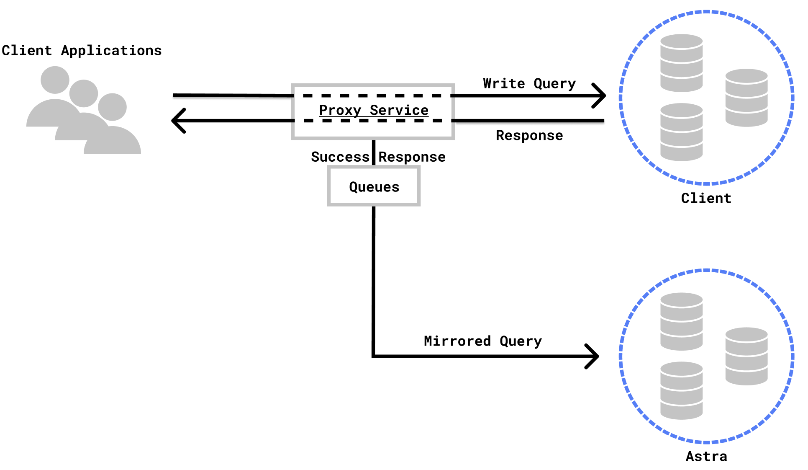
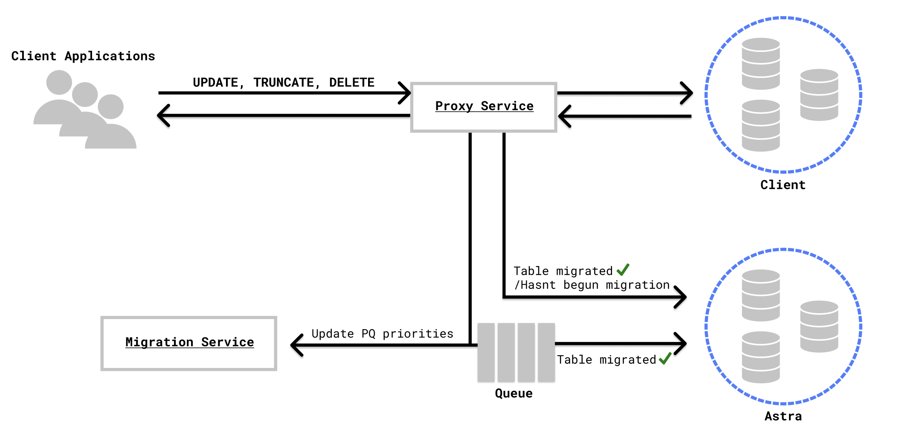
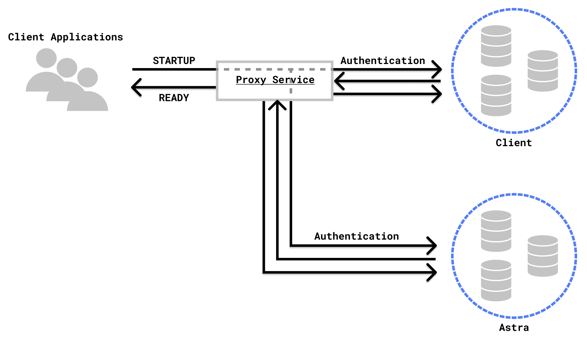

# Proxy Service

## Overview

During migration, our proxy acts as a tunnel between the client and the client’s old database. All bytes sent by the user are directly relayed to the old database, and all responses from the old database are relayed back to the user. During this process, however, our service inspects the data being transmitted and mirrors all write queries to the Astra database. Once migration has finished, the proxy begins redirecting all new connections directly to the Astra Database, and once there are no more connections to the client’s old database, signals that envoy can be redirected to point directly to the Astra database. 

## Environment Variables
    export SOURCE_HOSTNAME            // Hostname of client's DB           (string)
    export SOURCE_USERNAME            // Username to access client's DB    (string) 
    export SOURCE_PASSWORD            // Password to access client's DB    (string)
    export SOURCE_PORT                // Port of client's DB               (int)
    export ASTRA_HOSTNAME             // Hostname of Astra DB              (string)
    export ASTRA_USERNAME             // Username to access Astra DB       (string) 
    export ASTRA_PASSWORD             // Password to access Astra DB       (string)
    export ASTRA_PORT                 // Port of Astra DB                  (int)
    export PROXY_QUERY_PORT           // Port proxy listens on for queries (int)
    export MIGRATION_COMPLETE         // Flag of migration status          (bool)
    export MIGRATION_SERVICE_HOSTNAME // Hostname of migration service     (string)
    export MIGRATION_PORT             // Port of migration service         (int)
    export PROXY_SERVICE_HOSTNAME     // Hostname of proxy service         (string)
    export PROXY_PORT                 // Port of proxy service             (int)
    
    export DEBUG=true
    export TEST=true

These environment variables are read and processed into a `Config` struct, which is passed into the Proxy Service.

## Status Loop

Upon running `CQLProxy.Start()`, we begin a status loop that listens for three signals: MigrationStart, MigrationDone, and Shutdown.

- MigrationStart is triggered when the migration service sends us an `Update`  struct of type `Start`  with a `migration.``Status` struct containing the schema for the client’s database. After receiving this, we initialize our internal variables to fit the schema and run `p.listen(p.Conf.ListenPort, p.handleDatabaseConnection)`. This is done by sending a struct through `ReadyChan`, which `CQLProxy.Start()` waits on.
- MigrationDone is triggered when the migration service sends us an `Update` struct of type `Complete`. This sets `MigrationComplete` to `True` and causes future connections to the proxy to connection directly to Astra rather than tunnel to the old database.
- Shutdown tells the proxy to stop all forwarding and close all connections.
## Proxying CQL Requests

Our proxy reads in CQL commands sent by the client and parses the commands using CQL’s Binary Protocol v4. Every connection to the proxy runs `handleDatabaseConnection()`, which spawns 2 `forward()` goroutines (one for requests from client → database and one for replies from database → client).

All requests from the client are sent to the client’s database, and the proxy waits for a reply. The proxy then reads these replies and passes on queries that got a successful reply. This eliminates, among other things, bad inputs that would yield syntax errors.

Requests to be forwarded to Astra are passed through `CQLProxy.writeToAstra()` and are sorted by opcode. Most writes are mirrored directly to Astra, but actions that function based on existing data like UPDATE and DELETE are queued if the table they are acting on is currently being migrated.

- A queue is required because of the following edge case: If a table has been unloaded from the old database by the migration service but has not been loaded into Astra yet, any UPDATE commands received at this point will not be properly applied to Astra because not all the data is there yet, but also the UPDATE will not get applied to the unloaded data. Thus, we must record all commands, wait for migration service to unload the table’s data, and then replay the commands on the complete set of data.

Furthermore, timestamps are appended to all commands that go through our proxy to the Astra Database to ensure that new modifications don’t get overridden by old data being loaded from migration service, and to ensure that when we’re applying any queued queries, applying a query multiple times does not corrupt the data. If a timestamp is already applied to a query (such as ones sent through default cqlsh), we leave those unaltered; however, if a query is sent without a timestamp, we add one to the query. If a timestamp is written directly within the query such as:
`INSERT INTO tasks(id, task) VALUES (now(), 'task') USING TIMESTAMP 123456789;`
We do not alter the timestamp, and the timestamp specified directly within the query will be respected.

**Process for Executing and Queuing CQL commands**
Commands are executed through a queue on a per-table basis: 

    CQLProxy.queues = map[keyspace]map[table]chan *Query

New commands are added to their table’s queue through `writeToAstra()`, and commands are executed from the queue by their respective `consumeQueue(keyspace, table)` goroutine. Whenever an UPDATE, DELETE, or TRUNCATE command is run while its corresponding table is being migrated, `stopTable(keyspace, table)` is run, and `consumeQueue` blocks until `startTable(keyspace, table)` is run.

The process to stop the consumption of queues is as follows:

1. The migration service signals that they want to begin migrating a table by sending a `TableUpdate` with step `WaitingToUnload` (see *Communicating with Migration Service*)
2. Proxy service updates the table’s status to `WaitingToUnload` and sends a `Success` update back to migration service. From this point on, any UPDATE, DELETE, or TRUNCATE command to that table will cause `stopTable()` to be run.
3. Once the migration service receives the `Success` update from the proxy service, it begins unloading.

This process is necessary to avoid situations where unloading begins before the proxy service knows to queue updates. For example, if the migration has started but a new UPDATE query comes in and is executed before the proxy receives the TableUpdate. In that situation, it is possible that the query is mid-execution and the migration service has grabbed data that hasn’t had the query applied, and the proxy service does not know that it must queue and reapply the command after loading into Astra, thus leading to a loss of the UPDATE on some subset of rows.

**BATCH Statements**
Because BATCH statements must maintain the fact that all commands execute or non-execute, some issues arise when BATCH statements are mixed with pausing tables. For example, if a BATCH statement inserts into table X and table Y but table Y is paused, the insert into table X should not go through and table X must be paused as well. Thus, we handle BATCH statements as follows:

- The full BATCH query is added to the queue corresponding to one of the tables that it involves.
- We insert a dummy query into the queues of the other tables that the BATCH statement involves.
- All of the above queries are added to a wait group. When a query associated with the BATCH statement reaches the end of its queue and is removed to be executed, it blocks the `consumeQueue` gorountine until all of the BATCH’s queries reach the end of their respective queues.
- After all queries reach the end of their queues, the wait group unblocks and the full BATCH query is executed while the dummy queries are discarded.

**PREPARE and EXECUTE Statements**
PREPARE statements can yield different prepareIDs on different machines. Thus, the proxy must map client database prepareIDs to Astra prepareIDs. When an EXECUTE statement is run, the request is sent to the client unmodified. Then, when forwarding to Astra, we replace the client prepareID in the EXECUTE command with its respective Astra prepareID.

The `forward` gorountine keeps track of `streamID → fullQuery` when it sees PREPARE requests from the client.. These are stored in `outstandingQueries`.

Upon RESPONSE replies from the client database, the proxy stores `prepareID → fullQuery` in the map `preparedQueryBytes`.

`astraReplyHandler` listens for responses from Astra. Upon seeing RESPONSE frames to a PREPARE statement, the proxy creates the mapping of `client prepareID → Astra prepareID` in `mappedPrepareIDs`

When EXECUTE statements are forwarded to Astra through `writeToAstra()`, `mappedPrepareIDs`  is used to replace the client prepareID with its respective Astra prepareID.

`preparedQueryBytes` is also used by `cqlparser.CassandraParseRequest()` to determine what action an EXECUTE statement contains. It looks up the original PREPARE frame within `preparedQueryBytes` and parses it to determine the action to be executed.

## Keyspace Support

As there may be multiple users accessing the database simultaneously, we must keep track of the keyspace of each individual session instead of one global keyspace. Thus we use a map from the client’s IP & port to the corresponding keyspace that said client is in and when executing a USE query, we only update the keyspace of the corresponding connection. Since we are queueing queries and queries on some tables may be eventually executed after the client has switched to a new keyspace, we must also store the corresponding keyspace that each query was ran in. To do this, we ensure that an explicit declaration of the keyspace is within each query.  

        For example, if the use is in keyspace `codebase` and they run:
                `INSERT INTO tasks(id, task) VALUES (now(),` `'``codebase``'``);`
        We take this query and transform it into:
                `INSERT INTO codebase.tasks(id, task) VALUES (now(), 'codebase');`

If the query already includes an explicit declaration of the keyspace, we do not alter it. 

## CQL Parser

The CQL parser is largely adapted from https://github.com/cilium/cilium/blob/2bc1fdeb97331761241f2e4b3fb88ad524a0681b/proxylib/cassandra/cassandraparser.go

CQL requests from the client to their database are parsed based on the CQL wire protocol v4. A summary of the command’s contents is returned in the form `"/opcode/table/action``"`.

Responses from the database are parsed for two things. The first is the `PreparedID` that results from a PREPARE statement to the database. This is stored to allow for handling of the initial request at the time of EXECUTE. The response parsing also checks for the successful completion of requests by linking requests to responses using `StreamID`. If there is an error, it performs a few retries by signaling `CQLProxy.executeAndCheckReply(q *Query)`

## Migration Completion

When migration completes, the proxy looks to redirect all connections directly to Astra. However, direct connections to Astra cannot be initiated until all queued commands stored by the proxy service are executed.

After receiving a MigrationComplete signal, the proxy runs `CQLProxy.redirectActiveConnectionsToAstra()`. This monitors the sizes of the proxy service’s queues. When all queues are under `thresholdToRedirect`, proxy blocks all existing connections until all queues are emptied. Then, it redirects all active `forward()` gorountines to forward directly to Astra and all `astraReplyHandler()` gorountines to forward Astra replies to the client. 

After this point, new connections will be directly tunneled to Astra.

## Communication with Migration Service

We use Golang’s `net` package to communicate w/ the proxy service using our own protocol over TCP. The proxy service listens for messages from migration service on port `PROXY_PORT` and writes messages to the migration service to port `MIGRATION_PORT`. Messages are sent in the form of serialized `Update` structs between proxy service and migration service.

    // Update represents a request between the migration and proxy services
    type Update struct {
       ID    uuid.UUID
       Type  UpdateType
       Data  []byte
       Error string
    }
    // UpdateType is an enum of types of update between the proxy and migration services
    type UpdateType int
    const (
       TableUpdate = iota
       Start
       Complete
       Shutdown
       Success
       Failure
    )

Based on the `Type` of each `Update`, we know how to unmarshal `Data`.

- `Start` messages signify that the `Data` attached is in the form of a `migration.Status` struct, which contains information about the old database’s schema.

    // Status represents status of migration
    type Status struct {
       Timestamp  time.Time
       Tables     map[string]map[string]*Table
       Steps      int
       TotalSteps int
       Speed      float64
       Lock       *sync.Mutex
    }

- `TableUpdate` messages signify that the `Data` attached is in the form of a `migration.Table` struct. This is sent whenever the migration status of a table changes, i.e. when the migration service begins unloading a table. This informs the proxy service of when it should begin queuing UPDATES and when it can resume consuming queues.

    // Table represents status of migration of a single table
    type Table struct {
       Keyspace string
       Name     string
       Step     Step
       Error    error
       Priority int
    
       Lock *sync.Mutex
    }

Upon receiving a message from migration service and properly handling it, the proxy service sends back a `Success` or `Failure` update to inform migration service that the message was received and processed in some form.

Proxy also communicates to migration service about the size of queries. This is so that migration can expedite the export of tables with a big backlog of queries. This is handled in `filter.queueQuery`.

## Authentication

Proxy service handles authentication of user to both Astra and the client's database. Currently, only username and password authentication is supported. During migration, all users are authenticated with the username and password supplied in the environment variables:

    SOURCE_USERNAME
    SOURCE_PASSWORD
    ASTRA_USERNAME
    ASTRA_PASSWORD

This process is handled by `auth.HandleStartup()`, which is called in `forward()`. When proxying STARTUP frames, our service handles the initial authentication handshake with both the client’s old database and Astra before allowing the client to enter further commands.

After migration is complete, users will need to specify their own username and password to connect to Astra.

## Limitations and Assumptions
- We assume that users are not allowed to alter the database scheme in any fashion during migration. This includes `CREATE TABLE`, `DROP TABLE`, and other such commands
- We realize that not all UPDATE statements need to pause queues because UPDATE statements without an "IF EXIST" or equivalent function as UPSERTs. However, we did not have the time to properly figure out how to parse for such conditions.
## Known Issues
- Keyspace support: The following edge case is not currently handled (due to logic in `Query.addKeyspace()`)
    - A DELETE statement involves a column with the same name as the table, i.e. `DELETE name FROM name`
- BATCH query support: currently does not support BATCH commands sent as plaintext with a QUERY opcode (this is how CQLSH sends BATCHs, which doesn't appear to follow the wire protocol)
- All tests were run on cqlsh such that we assume no error in the service if there is no error on cqlsh. One example of where cqlsh behavior contradicted our assumptions was in the redirection of the proxy service. After migration completes, proxy must redirect the connection to the Astra database to bypass the proxy service. Because of this redirect, two successes are sent back to the client's cqlsh which does not error.